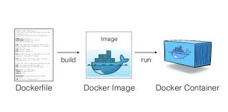

# Docker 


](<Docker Image container.png>)

## Create docker image with "Dockerfile"
```
#download based image from dockerhub.com
FROM python:3.12-slim

# create new app folder in linux image
WORKDIR /app 

#Copy from based-operating-system to linux image
#Copy source destination
# copy everything from source-operating-system to linux image
COPY . ./app/

# run python file code
CMD pyhton ./app/my_code.py
```

`docker build -t <my-dev-image> .` <br>
if you want to create image with any specfic env like dev, test, opt then use below command.<br>
`docker build -f Dockerfile.dev -t my-dev-image .`

## Run Container
`docker run --name <name> -it <image-name> /bin/bash`

