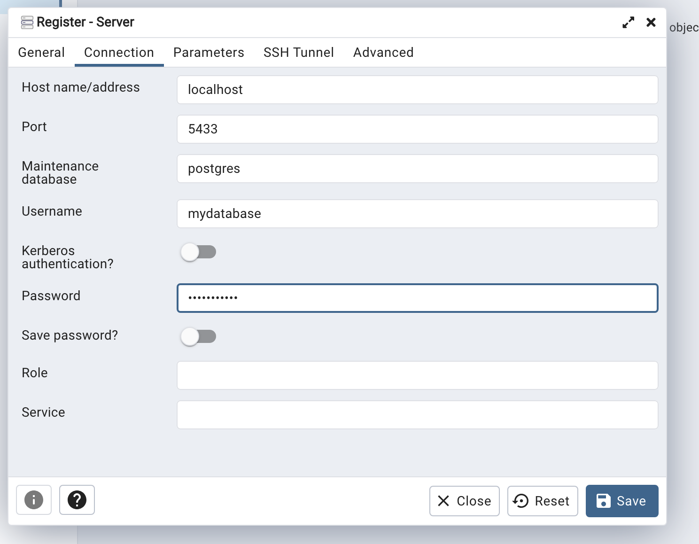
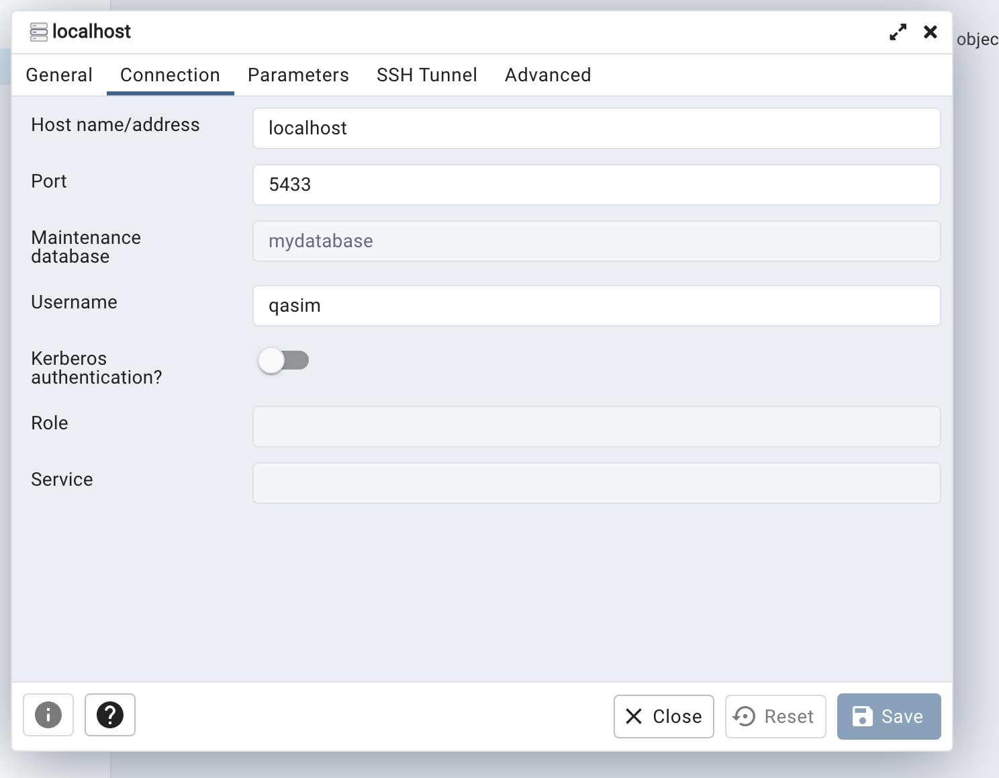

`docker-compose up --build`
```
environment:
- POSTGRES_USER=qasim
- POSTGRES_PASSWORD=my_password
- POSTGRES_DB=mydatabase
ports:
- '5433:5432'
```
    * **5433**




https://chatgpt.com/share/4c03b4b0-3594-4b8e-b2be-3869c1777131
