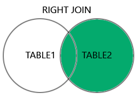

`docker-compose up --build`
```
environment:
- POSTGRES_USER=qasim
- POSTGRES_PASSWORD=my_password
- POSTGRES_DB=mydatabase
ports:
- '5433:5432'
```
    * **5433**

<!--  -->


https://chatgpt.com/share/4c03b4b0-3594-4b8e-b2be-3869c1777131
---------
Here's a PostgreSQL schema to create the `students`, `teachers`, and `fees` tables with relationships and 10 sample Pakistani names:

### 1. **Create Tables**

```sql
-- Creating the teachers table
CREATE TABLE teachers (
    teacher_id SERIAL PRIMARY KEY,
    teacher_name VARCHAR(100),
    subject VARCHAR(50)
);

-- Creating the students table
CREATE TABLE students (
    student_id SERIAL PRIMARY KEY,
    student_name VARCHAR(100),
    teacher_id INT,
    CONSTRAINT fk_teacher
      FOREIGN KEY(teacher_id) 
      REFERENCES teachers(teacher_id)
);

-- Creating the fees table
CREATE TABLE fees (
    fee_id SERIAL PRIMARY KEY,
    student_id INT,
    fee_amount NUMERIC(10, 2),
    fee_paid_date DATE,
    CONSTRAINT fk_student
      FOREIGN KEY(student_id) 
      REFERENCES students(student_id)
);
```

### 2. **Insert Sample Data**

Here are the inserts for sample Pakistani names:

```sql
-- Inserting data into teachers table
INSERT INTO teachers (teacher_name, subject)
VALUES
('Ahmad Raza', 'Mathematics'),
('Fatima Saeed', 'Physics'),
('Usman Ali', 'Computer Science');

-- Inserting data into students table
INSERT INTO students (student_name, teacher_id)
VALUES
('Mohammad Iqbal', 1),
('Ali Raza', 1),
('Hina Nawaz', 2),
('Sania Qamar', 2),
('Hassan Shahid', 3),
('Ayesha Noor', 3),
('Zain Ahmed', 1),
('Sara Khan', 2),
('Noman Aslam', 3),
('Rabia Malik', 2);

-- Inserting data into fees table
INSERT INTO fees (student_id, fee_amount, fee_paid_date)
VALUES
(1, 2000.00, '2024-08-01'),
(2, 1800.00, '2024-07-15'),
(3, 2500.00, '2024-08-10'),
(4, 2200.00, '2024-07-20'),
(5, 2300.00, '2024-08-05'),
(6, 2100.00, '2024-07-30'),
(7, 2400.00, '2024-08-07'),
(8, 2600.00, '2024-08-12'),
(9, 1900.00, '2024-07-18'),
(10, 2000.00, '2024-08-02');
```

This will set up your relational tables for students, teachers, and fees, with some sample Pakistani names for the demo. You can run these SQL commands in your PostgreSQL environment to create the schema and populate the data.

----------
# SQL queries


### q1
```sql

SELECT 
	student_id,
	student_name,
	teacher_id
FROM
	students;
```

### q2
```sql
SELECT
	teacher_id,
	student_name,
	student_name,
	student_name,
	student_id
	
FROM
	students;
```

### q3 Adnan query
```sql
SELECT
	subject,
	teacher_name
FROM
	teachers;
```

### q4
```sql
SELECT
	student_name,
	teacher_name
FROM
	students,
	teachers;
```


### q5 cross join (wrong way)
```sql
SELECT
	students.student_id,
	students.student_name,
	teachers.teacher_id,
	teachers.teacher_name
FROM
	students,
	teachers;
```

### q6 Inner join

```sql
SELECT
	students.student_id,
	students.student_name,
	teachers.teacher_id,
	teachers.teacher_name
FROM
	students,
	teachers
WHERE
	students.teacher_id = teachers.teacher_id;
	
```

### q7 task select two columns each tables (Sara completed)
```sql
SELECT 
	s.student_id,
	s.student_name,
	f.fee_amount,
	f.fee_paid_date,
	t.teacher_name
	
FROM
    students s inner join teachers t on s.teacher_id=t.teacher_id,
	students st inner join fees f on st.student_id=f.student_id;
```

```sql
SELECT 
	s.student_id,
	s.student_name,
	f.fee_amount,
	f.fee_paid_date,
	t.teacher_name
	
FROM
    students s inner join teachers t on s.teacher_id=t.teacher_id,
	students st inner join fees f on st.student_id=f.student_id;
```


#### Example
```python
l1 : [int] = [1,2,3,4,5,6,7]
l2 : [int] = [3,5,20,100]

#output
[3,5]
```





